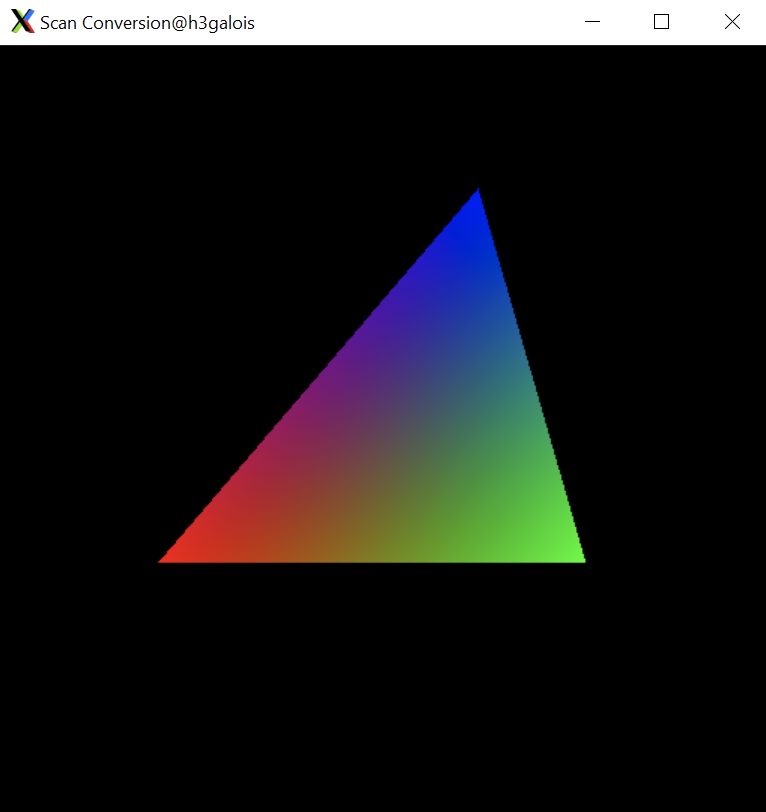

# Gouraud Shading with Triangles

In this assignment, I wrote a program that draws a triangle by clicking 3 points in the window and allows toggling of 3 modes: Wireframe, Flat and Gouraud Shading. 

Example of Gouraud Shading Mode:

