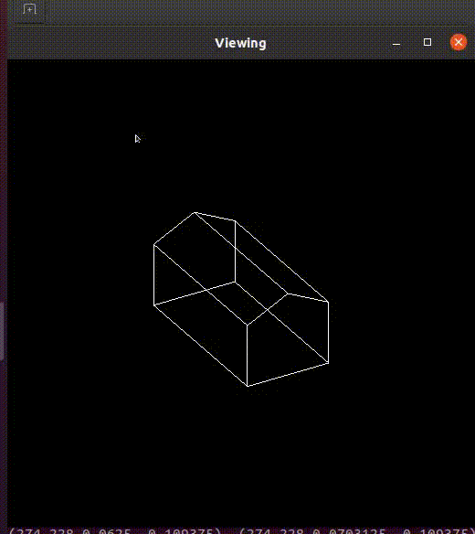

# Applying Matrix Transformations
In this assignment, I worked on different transformations for a 3D model of a house for Orthographic and Perspective projections. These transformations include: rotate, scale and translate in xy and xz planes.

## Demo

<p align="center">

</p>

### Usage:

Use the following commands on your shell:
```bash
make template
make run
make clean
```
to compile the program, to run the program, and to delete unnecessary files, respectively.


The following are keys for the Transformations:
```c++
Modifier    Button    Key    Operation                      
-----------------------------------------------         
            left             Translate_xy                   
shift       left             Translate_xz                   
            right            Scale                          
            middle           Rotate                         
                      r      Reset                          
                      p      Toggle projection      
```
