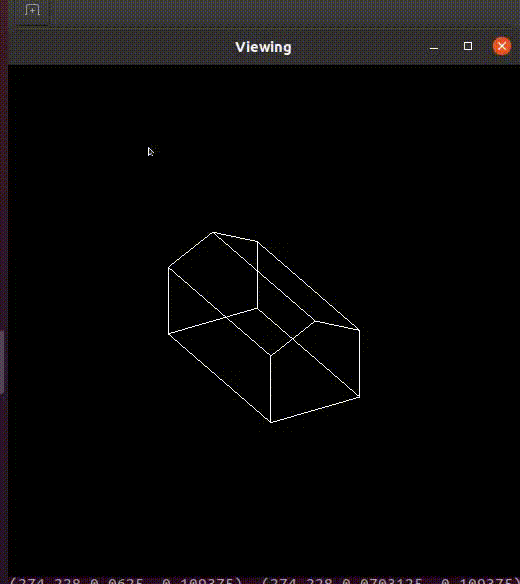

# Computer Graphics Algorithms

Programs from CMPSC457 at Penn State. The primary goal of this course was to explore the theories and techniques to draw geometrical objects on a discrete device. The topics include graphics systems/hardware, color models, rasterization, coordinate systems, transformations, projections, clipping, hidden line/surface removal, anti-aliasing, parametric curves/surfaces, 3D modeling, and animation.

---

### Gouraud Shading

### Ray Tracing

### Matrix Transformations

### PPM Image Generation - Checkerboard Pattern

